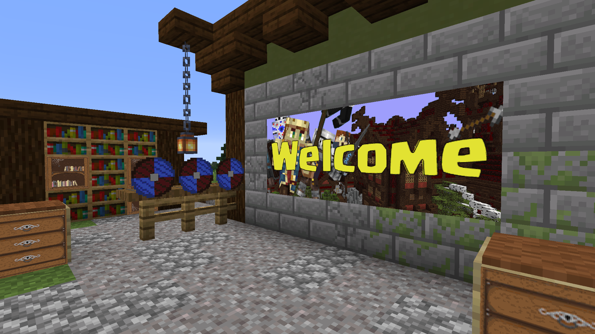

# ImageMaps

ImageMaps is a plugin for Bukkit  Minecraft servers that enables you to place custom images in your world
by rendering them onto maps and placing them in item frames.

This can be used to create info graphics, custom paintings and even the appearance of custom textures.



## Installation
You will need a Server that implements Bukkit 1.13 or newer and the Spigot-API. Some features are only available in newer
releases. Make sure to use the latest release of your server software before reporting issues.

Put the plugin into your servers `plugins` folder and start it up. A folder for the plugin will be created 
automatically. You can place your images in the `images` folder inside it.

### Upgrading from versions &lt; 1.0.0
The plugin should convert your maps.yml automatically. It will attempt to create a backup before doing so, 
but it is recommended to do one manually as well.

## Usage
In order for you use place images they must be present in the `images` folder. You can either put them
there via FTP or just copying it, or by using the plugin's download command, allowing you to access
images from the Internet.

To place images just run the `/imagemap place` command and right click the block that should be the
upper left corner of the image (based on your perspective).

Images will by default split into 128x128 pixel sub-images to fit on a map. The image may be scaled via
command parameters, however **it is recommended to prepare correctly scaled images**.

The color palette of Minecraft maps is very limited, requiring the plugin/Bukkit to convert the input image.
This will result in your images looking different ingame than the source. The available color table can be
found here: https://minecraft.gamepedia.com/Map_item_format#Color_table


The invisible and fixed item frame properties are only available in 1.16+. You can modify them for any item frame
by using a configurable (default a wooden hoe) items. Right click to toggle visibility and Shift+Right click to 
toggle the fixed state.

### Commands
* /imagemap place &lt;filename> [frameInvisible] [frameFixed] [size]
  * Starts the placement process
  * frameInvisible and frameFixed are only available on 1.16+
* /imagemap download &lt;filename> &lt;sourceURL>
  * downloads an image from the given URL into the `images` folder
* /imagemap info &lt;filename>
  * prints info, such as resolution and expected size
* /imagemap reload &lt;filename>
  * reloads an image, to be used when the image file changed
* /imagemap list [page]
  * lists all images in the `images` folder
* /imagemap help [command]
  * prints help for commands
  
### Permissions
`imagemaps.*` - grants access to all permissions  
`imagemaps.place` - grants access to /imagemap place command  
`imagemaps.download` - grants access to /download place command  
`imagemaps.info` - grants access to /imagemap info command  
`imagemaps.list` - grants access to /imagemap list command  
`imagemaps.reload` - grants access to /imagemap reload command  
`imagemaps.help` - grants access to /imagemap help command  
`imagemaps.toggleFixed` - allows to toggle the "fixed" state of frames with a wooden hoe  
`imagemaps.toggleVisible` - allows to toggle the "visible" state of frames with a wooden hoe  

All permissions are default true for OPs.


## Maven
You will need to [configure your environment to access GitHub repositories](https://docs.github.com/en/packages/using-github-packages-with-your-projects-ecosystem/configuring-apache-maven-for-use-with-github-packages).

```
<repository>
  <id>github</id>
  <name>ImageMaps repository</name>
  <url>https://maven.pkg.github.com/SydMontague/ImageMaps</url>
</repository>
```
```
<dependency>
  <groupId>net.craftcitizen</groupId>
  <artifactId>imagemaps</artifactId>
  <version>1.0.1</version>
</dependency>
```

## Contact 
* Discord: SydMontague#8056
* directly on GitHub
* E-Mail: sydmontague@web.de
* Spigot: https://www.spigotmc.org/members/sydmontague.37699/

This plugin has been developed for the [CraftCitizen](https://craftcitizen.net) survival Minecraft server.